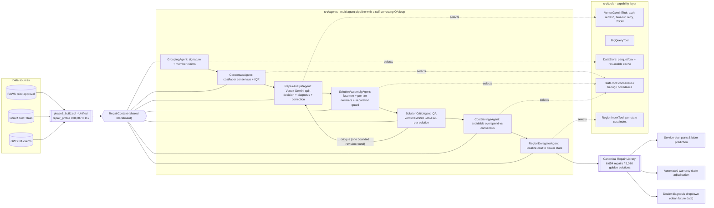
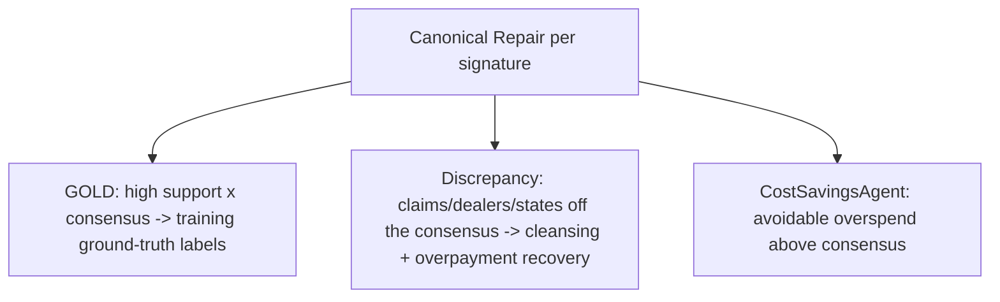

# Architecture - Canonical Repair Profiler (CRP)

A multi-agent pipeline over a shared context, backed by a defensive tool layer. The diagram is
authored as an SVG source at [`../figures/architecture.svg`](../figures/architecture.svg) and rendered
to [`../figures/architecture.png`](../figures/architecture.png) and the code-track root artifact
[`../architecture_diagram.png`](../architecture_diagram.png).

## Agent hand-off chain (multi-agent design)



## Agent sequence (one signature, with optional regional localization)

```mermaid
sequenceDiagram
    autonumber
    participant O as Orchestrator
    participant G as GroupingAgent
    participant C as ConsensusAgent
    participant R as RepairAnalystAgent
    participant S as SolutionAssemblyAgent
    participant Q as SolutionCriticAgent
    participant V as CostSavingsAgent
    participant D as RegionDelegatorAgent
    participant LLM as VertexGeminiTool
    participant ST as StatsTool
    participant RT as RegionIndexTool

    O->>G: load_signature(id)
    G-->>O: ctx.claims (member claims)
    O->>C: enrich(ctx)
    C->>ST: band() / consensus_fraction()
    C-->>O: ctx.consensus (cost/labor bands)
    O->>R: analyze(ctx)
    R->>LLM: generate_json(split + diagnosis prompt)
    alt LLM ok + payload passes schema validation
        LLM-->>R: {n_repairs, repairs[...]}  (retry/timeout-guarded)
        R-->>O: ctx.llm_decision
    else LLM failed or payload malformed
        R-->>O: ctx.llm_decision = single-repair shell (graceful degradation; chain continues)
    end
    O->>S: assemble(ctx)
    S->>ST: cost_tier_partition() + separation guard
    S-->>O: ctx.solutions (Canonical Repairs)
    O->>Q: review(ctx)
    Q-->>O: ctx.critique (PASS/FLAG/FAIL per solution)
    opt critic found revisable text defects (bounded: ONE round)
        O->>R: analyze(ctx, feedback=critique)
        R->>LLM: generate_json(prompt + REVISION REQUEST)
        O->>S: assemble(ctx)  (re-assemble)
        O->>Q: review(ctx, revised=true)  (final verdicts)
    end
    O->>V: analyze(ctx)
    V-->>O: + avoidable-overspend savings per solution
    opt state provided
        O->>D: apply(ctx, state)
        D->>RT: index_for(state)
        D-->>O: + region-localized cost
    end
    O-->>O: return ctx.solutions
```

## Shared context hand-off matrix

The judging rubric looks for task hand-offs and context sharing in `src/agents/`.
CRP makes that explicit with `RepairContext`:

- `GroupingAgent` reads `signature_id`, `vehicle_line`, `causal_part`, and `archetype`; writes `ctx.claims`.
- `ConsensusAgent` reads `ctx.claims`; writes `ctx.consensus` with cost/labor medians, IQRs, support, and agreement.
- `RepairAnalystAgent` reads `ctx.claims` and `ctx.consensus`; writes `ctx.llm_decision` from Vertex Gemini.
- `SolutionAssemblyAgent` reads `ctx.llm_decision`, `ctx.claims`, and `ctx.consensus`; writes `ctx.solutions`.
- `SolutionCriticAgent` reads `ctx.solutions` and `ctx.llm_decision`; writes `ctx.critique` and a `critic_verdict` per solution (and can hand the context back to `RepairAnalystAgent` for one bounded revision round).
- `CostSavingsAgent` reads `ctx.solutions` and claim costs; writes savings fields and `ctx.savings`.
- `RegionDelegatorAgent` reads `ctx.solutions`; writes `ctx.region` and localized cost/labor fields.
- `ClaimMatchAgent` reads the Canonical Repair Library and incoming claim text; returns a matched solution or `NO_MATCH`.

## Two-track output (same pipeline, two business outcomes)



## Key design properties
- **Single responsibility per agent**; the `RepairContext` is the only shared state and is handed off, not re-derived.
- **Self-correcting, but bounded**: the critic can send the context back to the analyst exactly once — quality feedback without livelock; structural failures mark the solution unusable instead of looping.
- **Numbers are deterministic** (StatsTool / RegionIndexTool); **only prose is LLM-generated** (RepairAnalystAgent) - auditable.
- **Every external call is defended** (timeout/retry/auth-refresh) in the tool layer; the batch is resumable; SDKs are imported lazily so the system is testable offline.
- **Configurable**: all project ids / model / paths / thresholds live in `src/config.py` (env-overridable), incl. a `CRP_USE_SAMPLE` offline mode.
- **Scales** from 940k PAWS claims to 88M Ford warranty claims unchanged.
